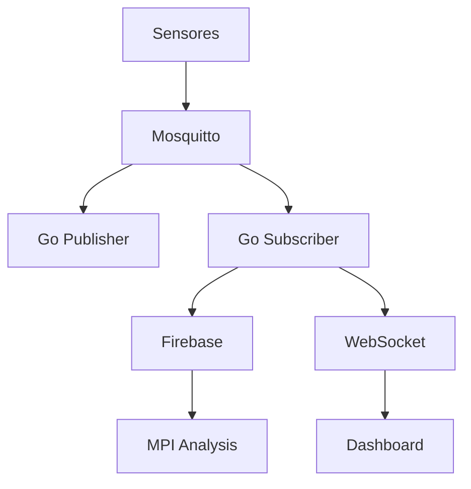

# Índice de Documentación

## <i class="fas fa-book"></i> Paradigmas y Lenguajes de Programación 2025
**Trabajo Final**  
**Autores**: Küster Joaquín • Da Silva Marcos • Martinez Lázaro Ezequiel

---

## Guía de Usuario

### Introducción
- [¿Qué es este sistema?](./guide/introduction.md#qué-es-este-sistema)
- [Características principales](./guide/introduction.md#características-principales)
- [Arquitectura de alto nivel](./guide/introduction.md#arquitectura-de-alto-nivel)
- [Stack tecnológico](./guide/introduction.md#stack-tecnológico)
- [Flujo de datos completo](./guide/introduction.md#flujo-de-datos-completo)
- [Casos de uso](./guide/introduction.md#casos-de-uso)

### Arquitectura del Sistema
- [Vista general](./guide/architecture.md#vista-general)
- [Componentes principales](./guide/architecture.md#componentes-principales)
  - [Mosquitto MQTT Broker](./guide/architecture.md#1-mosquitto-mqtt-broker)
  - [Go Publisher](./guide/architecture.md#2-go-publisher-simulador-de-sensores)
  - [Go Subscriber](./guide/architecture.md#3-go-subscriber-procesador-de-eventos)
  - [WebSocket Server](./guide/architecture.md#4-websocket-server)
  - [Firebase Realtime Database](./guide/architecture.md#5-firebase-realtime-database)
  - [MPI Backend](./guide/architecture.md#6-mpi-backend-procesamiento-paralelo)
  - [Dashboard Frontend](./guide/architecture.md#7-dashboard-frontend)
- [Patrones de diseño](./guide/architecture.md#patrones-de-diseño)
- [Flujo de ejecución completo](./guide/architecture.md#flujo-de-ejecución-completo)

### Instalación
- [Requisitos previos](./guide/installation.md#requisitos-previos)
- [Instalación de dependencias](./guide/installation.md#instalación-de-dependencias)
  - [Instalar Go](./guide/installation.md#1-instalar-go)
  - [Instalar Node.js](./guide/installation.md#2-instalar-nodejs)
  - [Instalar Mosquitto](./guide/installation.md#3-instalar-mosquitto)
- [Configuración del proyecto](./guide/installation.md#configuración-del-proyecto)
  - [Configurar Firebase](./guide/installation.md#2-configurar-firebase)
  - [Ejecutar script de instalación](./guide/installation.md#3-ejecutar-script-de-instalación)
  - [Inicializar base de datos](./guide/installation.md#4-inicializar-base-de-datos)
- [Configuración avanzada](./guide/installation.md#configuración-avanzada)
- [Solución de problemas](./guide/installation.md#solución-de-problemas)

### Ejecución del Sistema
- [Script de control](./guide/running.md#script-de-control-monitoreosh)
- [Iniciar el sistema](./guide/running.md#iniciar-el-sistema)
  - [Inicio completo](./guide/running.md#inicio-completo)
  - [Inicio manual](./guide/running.md#inicio-manual-componente-por-componente)
- [Verificar estado](./guide/running.md#verificar-estado)
- [Acceder al dashboard](./guide/running.md#acceder-al-dashboard)
- [Detener el sistema](./guide/running.md#detener-el-sistema)
- [Monitoreo de logs](./guide/running.md#monitoreo-de-logs)
- [Casos de uso comunes](./guide/running.md#casos-de-uso-comunes)

---

## <i class="fas fa-broadcast-tower"></i> Referencia de API

### WebSocket API
- [Servidor WebSocket](./api/websocket.md#servidor-websocket)
- [Endpoints disponibles](./api/websocket.md#endpoints-disponibles)
  - [/ws/resumenes](./api/websocket.md#1-wsresumenes) - Resúmenes de consumo
  - [/ws/avisos](./api/websocket.md#2-wsavisos) - Alertas y notificaciones
  - [/ws/dispositivos](./api/websocket.md#3-wsdispositivos) - Control de dispositivos
  - [/ws/params](./api/websocket.md#4-wsparams) - Configuración del sistema
  - [/ws/oficinas](./api/websocket.md#5-wsoficinas) - Gestión de oficinas
- [Ejemplo completo de cliente](./api/websocket.md#ejemplo-completo-de-cliente)
- [Manejo de errores](./api/websocket.md#manejo-de-errores)

### MQTT API
- [Broker MQTT](./api/mqtt.md#broker-mqtt)
- [Estructura de tópicos](./api/mqtt.md#estructura-de-tópicos)
- [Formato de mensajes](./api/mqtt.md#formato-de-mensajes)
- [Publisher (Go)](./api/mqtt.md#publisher-go)
- [Subscriber (Go)](./api/mqtt.md#subscriber-go)
- [Flujo de mensajes](./api/mqtt.md#flujo-de-mensajes)
- [Ejemplos de clientes](./api/mqtt.md#ejemplo-de-cliente-python)
  - [Cliente Python](./api/mqtt.md#ejemplo-de-cliente-python)
  - [Cliente JavaScript](./api/mqtt.md#ejemplo-de-cliente-javascript-nodejs)
- [Monitoreo de tópicos](./api/mqtt.md#monitoreo-de-tópicos)
- [Configuración de Mosquitto](./api/mqtt.md#configuración-de-mosquitto)
- [Seguridad](./api/mqtt.md#seguridad-producción)

---

## <i class="fas fa-wrench"></i> Información Técnica

### Tecnologías Utilizadas

#### Backend
- **Go 1.19+** - Publisher y Subscriber MQTT
- **Node.js 14+** - WebSocket y HTTP servers
- **Mosquitto 2.0+** - MQTT Broker
- **Firebase** - Realtime Database
- **C + OpenMPI** - Procesamiento paralelo

#### Frontend
- **HTML5/CSS3/JavaScript** - Dashboard
- **Chart.js** - Visualizaciones
- **WebSocket API** - Comunicación en tiempo real

#### Documentación
- **VitePress** - Framework de documentación
- **Vue 3** - Componentes interactivos
- **Mermaid.js** - Diagramas
- **Markdown** - Contenido

### Estructura de Datos

#### Firebase Schema
```
monitoreo_consumo/
├── configuracion/
├── tipos_avisos/
└── oficinas/
    ├── {id}/
    │   ├── avisos/
    │   ├── resumenes/
    │   └── estados_dispositivos/
```

#### Mensaje MQTT
```json
{
  "oficina": "A",
  "timestamp": 1701648000,
  "presencia": true,
  "corriente_a": 12.5,
  "temperatura": 24.3
}
```

---

## <i class="fas fa-chart-bar"></i> Diagramas del Sistema

### Arquitectura General


### Flujo de Datos
1. **Generación**: Publisher simula datos cada 10s
2. **Publicación**: Datos → MQTT
3. **Procesamiento**: Subscriber detecta alertas
4. **Persistencia**: Datos → Firebase
5. **Distribución**: WebSocket → Dashboard
6. **Visualización**: Gráficos en tiempo real

---

## <i class="fas fa-graduation-cap"></i> Información Académica

**Materia**: Paradigmas y Lenguajes de Programación  
**Año**: 2025  
**Tipo**: Trabajo Final  

**Integrantes**:
- Küster Joaquín
- Da Silva Marcos
- Martinez Lázaro Ezequiel

**Institución**: Universidad Nacional de Misiones (UNAM)
**Facultad**: Facultad de Ciencias Exactas Quimicas y Naturales

### Paradigmas Implementados

1. **Programación Imperativa** - Go (Publisher/Subscriber)
2. **Programación Orientada a Eventos** - Node.js (WebSocket)
3. **Programación Funcional** - JavaScript (Dashboard)
4. **Programación Paralela** - MPI (Análisis)
5. **Programación Reactiva** - WebSocket (Tiempo real)

### Patrones de Diseño

- **Publisher-Subscriber** (MQTT)
- **Observer** (WebSocket)
- **Singleton** (Firebase client)
- **Factory** (Creación de sensores)
- **Strategy** (Detección de alertas)

---

## <i class="fas fa-phone"></i> Contacto y Soporte

Para preguntas sobre este proyecto:
- Consultar la [documentación completa](/)
- Revisar la sección de [solución de problemas](./guide/installation.md#solución-de-problemas)
- Verificar los [logs del sistema](./guide/running.md#monitoreo-de-logs)

---

## <i class="fas fa-edit"></i> Notas de Versión

**Versión 1.0.0** - Diciembre 2024
- <i class="fas fa-check-circle"></i> Sistema completo de monitoreo en tiempo real
- <i class="fas fa-check-circle"></i> Arquitectura MQTT + WebSocket
- <i class="fas fa-check-circle"></i> Dashboard interactivo
- <i class="fas fa-check-circle"></i> Procesamiento paralelo MPI
- <i class="fas fa-check-circle"></i> Documentación completa con VitePress
- <i class="fas fa-check-circle"></i> 13 tipos de alertas automáticas
- <i class="fas fa-check-circle"></i> Gestión dinámica de oficinas
- <i class="fas fa-check-circle"></i> Configuración en caliente

---

<div align="center">
  <strong>Sistema de Monitoreo de Consumo Eléctrico</strong><br>
  Paradigmas y Lenguajes de Programación 2025<br>
  <em>Küster Joaquín • Da Silva Marcos • Martinez Lázaro Ezequiel</em>
</div>
