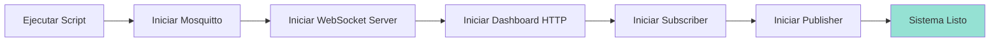
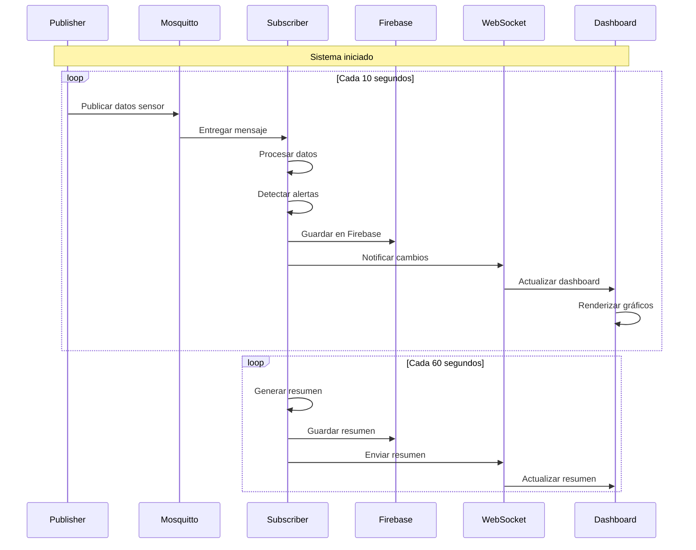

# Ejecución del Sistema

Esta guía explica cómo iniciar, detener y monitorear el Sistema de Monitoreo de Consumo Eléctrico.

## Script de Control (`monitoreo.sh`)

El sistema incluye un script Bash que facilita la gestión de todos los componentes.

### Comandos Disponibles

```bash
./monitoreo.sh instalar   # Primera configuración
./monitoreo.sh comenzar   # Iniciar sistema completo
./monitoreo.sh estado     # Ver estado de servicios
./monitoreo.sh parar      # Detener todos los servicios
./monitoreo.sh ayuda      # Mostrar ayuda
```

## Iniciar el Sistema

### Inicio Completo

```bash
./monitoreo.sh comenzar
```

**Proceso de inicio**:



**Salida esperada**:

```
<i class="fas fa-rocket"></i> Iniciando Sistema de Monitoreo de Consumo...
<i class="fas fa-broadcast-tower"></i> Iniciando Mosquitto MQTT Broker...
<i class="fas fa-check-circle"></i> Mosquitto iniciado (PID: 12345)
<i class="fas fa-plug"></i> Iniciando WebSocket Server...
<i class="fas fa-check-circle"></i> Servidor WebSocket escuchando en puerto 8081
<i class="fas fa-globe"></i> Iniciando Dashboard...
<i class="fas fa-check-circle"></i> Servidor HTTP escuchando en `http://localhost:8080`
<i class="fas fa-download"></i> Iniciando Subscriber...
<i class="fas fa-check-circle"></i> Subscriber conectado a MQTT
<i class="fas fa-chart-bar"></i> Iniciando Publisher...
<i class="fas fa-check-circle"></i> Publisher conectado a MQTT
<i class="fas fa-check-circle"></i> Todos los componentes iniciados correctamente!

<i class="fas fa-globe"></i> Abre tu navegador en: `http://localhost:8080`

<i class="fas fa-chart-line"></i> El sistema está funcionando. Esperando datos...

<i class="fas fa-lightbulb"></i> Presiona Ctrl+C para detener todos los servicios
```

### Inicio Manual (Componente por Componente)

Si prefieres control granular:

#### 1. Iniciar Mosquitto

```bash
mosquitto -c config/mosquitto.conf -v
```

Verás:
```
1701648000: mosquitto version 2.0.18 running
1701648000: Opening ipv4 listen socket on port 1883.
```

#### 2. Iniciar WebSocket Server

```bash
node socket.js
```

Verás:
```
<i class="fas fa-plug"></i> Iniciando servidor WebSocket...
<i class="fas fa-check-circle"></i> Servidor WebSocket escuchando en puerto 8081
<i class="fas fa-check-circle"></i> Servidores WebSocket listos:
   <i class="fas fa-chart-bar"></i> ws://localhost:8081/ws/resumenes
   <i class="fas fa-bell"></i> ws://localhost:8081/ws/avisos
   <i class="fas fa-lightbulb"></i> ws://localhost:8081/ws/dispositivos
<i class="fas fa-sync-alt"></i> Iniciando simulación de datos en tiempo real...
```

#### 3. Iniciar Dashboard HTTP

```bash
node dashboard.js
```

Verás:
```
<i class="fas fa-check-circle"></i> Servidor HTTP escuchando en `http://localhost:8080`
```

#### 4. Iniciar Subscriber

```bash
cd mqtt/subscriber
go run main.go
```

Verás:
```
<i class="fas fa-plug"></i> Cliente conectado a PARAMS
<i class="fas fa-clipboard"></i> Lista de oficinas actualizada: [A B C]
<i class="fas fa-check-circle"></i> Nueva oficina inicializada: A
<i class="fas fa-check-circle"></i> Nueva oficina inicializada: B
<i class="fas fa-check-circle"></i> Nueva oficina inicializada: C
```

#### 5. Iniciar Publisher

```bash
cd mqtt/publisher
go run main.go
```

Verás:
```
<i class="fas fa-plug"></i> Probando conexión WebSocket...
<i class="fas fa-check-circle"></i> WebSocket conectado correctamente
<i class="fas fa-check-circle"></i> LISTA DE OFICINAS ACTUALIZADA: [A B C]
[PUBLICADO] oficinas/A/sensores -> {"oficina":"A","timestamp":1701648000,...}
```

## Verificar Estado

```bash
./monitoreo.sh estado
```

**Salida esperada**:

```
<i class="fas fa-chart-bar"></i> Estado del Sistema de Monitoreo de Consumo

<i class="fas fa-check-circle"></i> Mosquitto: EJECUTÁNDOSE
<i class="fas fa-check-circle"></i> Servicios Node.js: EJECUTÁNDOSE (2 procesos)
<i class="fas fa-check-circle"></i> Servicios Go: EJECUTÁNDOSE (2 procesos)
<i class="fas fa-check-circle"></i> Sistema principal: EJECUTÁNDOSE (PID: 12340)

<i class="fas fa-lightbulb"></i> Usa './monitoreo.sh comenzar' para iniciar el sistema
<i class="fas fa-lightbulb"></i> Usa './monitoreo.sh parar' para detener todo
```

## Acceder al Dashboard

Una vez iniciado el sistema:

1. Abre tu navegador
2. Navega a: `http://localhost:8080`
3. Verás el dashboard con datos en tiempo real

### Características del Dashboard

#### Panel de Resúmenes

Muestra para cada oficina:
- **Corriente actual** (Amperes)
- **Consumo** (kWh)
- **Consumo total acumulado**
- **Temperatura mínima/máxima**
- **Tiempo de presencia**
- **Costo estimado**
- **Costo total**

#### Panel de Avisos

Lista de alertas en tiempo real:
- Timestamp
- Tipo de aviso
- Información adicional

#### Panel de Dispositivos

Control de:
- <i class="fas fa-lightbulb"></i> **Luces** (ON/OFF)
- <i class="fas fa-snowflake"></i> **Aire acondicionado** (ON/OFF)

#### Panel de Configuración

Ajustar parámetros:
- Hora de inicio/fin
- Umbral de temperatura para AC
- Umbral de corriente
- Voltaje
- Costo por kWh

#### Gestión de Oficinas

- <i class="fas fa-plus-circle"></i> Agregar nuevas oficinas
- <i class="fas fa-trash-alt"></i> Eliminar oficinas existentes

## Detener el Sistema

### Detención Completa

```bash
./monitoreo.sh parar
```

O presiona **Ctrl+C** si iniciaste con `./monitoreo.sh comenzar`

**Salida esperada**:

```
<i class="fas fa-stop-circle"></i> Deteniendo Sistema de Monitoreo (PID: 12340)...
<i class="fas fa-check-circle"></i> Mosquitto detenido (PID: 12345)
<i class="fas fa-check-circle"></i> Todos los servicios detenidos
```

### Detención Manual

Si iniciaste componentes manualmente:

```bash
# Detener cada proceso con Ctrl+C
# O buscar y matar procesos

# Linux/macOS
pkill -f mosquitto
pkill -f "node socket.js"
pkill -f "node dashboard.js"
pkill -f "go run main.go"

# Windows
taskkill /F /IM mosquitto.exe
taskkill /F /IM node.exe
taskkill /F /IM go.exe
```

## Monitoreo de Logs

### Logs de Mosquitto

```bash
tail -f logs/mosquitto.log
```

Verás:
```
1701648000: New connection from 127.0.0.1:54321 on port 1883.
1701648000: New client connected from 127.0.0.1:54321 as publicador-sensores
1701648000: Received PUBLISH from publicador-sensores (d0, q0, r0, m0, 'oficinas/A/sensores', ... (123 bytes))
```

### Logs del Publisher

El Publisher muestra:
```
<i class="fas fa-plug"></i> Calculando corriente - Presencia: true, Temp: 24.5, UmbralTemp: 25.0
<i class="fas fa-lightbulb"></i> Oficina A - Luces: true, Aire: false
<i class="fas fa-lightbulb"></i> Luces encendidas (+3.0A)
<i class="fas fa-plug"></i> Corriente final: 8.2A
[PUBLICADO] oficinas/A/sensores -> {"oficina":"A",...}
```

### Logs del Subscriber

El Subscriber muestra:
```
[AVISO] Oficina:A Tipo:1 Más:
[RESUMEN] Oficina:A {Timestamp:1701648000 CorrienteA:8.2 ConsumoKvh:1.8 ...}
Resumen guardado en: monitoreo_consumo/oficinas/A/resumenes/-NqXYZ123
```

## Flujo de Datos en Ejecución



## Casos de Uso Comunes

### Agregar una Nueva Oficina

1. En el dashboard, ve a la sección "Gestión de Oficinas"
2. Ingresa el ID de la nueva oficina (ej: "D")
3. Click en "Agregar Oficina"
4. El Publisher comenzará a generar datos para la nueva oficina automáticamente

### Cambiar Configuración

1. En el dashboard, ve a "Configuración de Parámetros"
2. Modifica los valores deseados
3. Click en "Guardar Configuración"
4. Los cambios se aplican inmediatamente a Publisher y Subscriber

### Controlar Dispositivos

1. En el panel de cada oficina, usa los toggles:
   - <i class="fas fa-lightbulb"></i> Luces
   - <i class="fas fa-snowflake"></i> Aire Acondicionado
2. El cambio se refleja inmediatamente en el consumo

## Solución de Problemas

### Dashboard no carga

**Verificar**:
```bash
# ¿Está corriendo el servidor HTTP?
curl http://localhost:8080
# Debe devolver HTML

# ¿Está corriendo WebSocket?
curl http://localhost:8081
# Debe devolver "Upgrade Required"
```

**Solución**:
```bash
# Reiniciar servidores
./monitoreo.sh parar
./monitoreo.sh comenzar
```

### No se ven datos en el dashboard

**Verificar**:
```bash
# ¿Está corriendo el Publisher?
./monitoreo.sh estado
# Debe mostrar "Servicios Go: EJECUTÁNDOSE (2 procesos)"
```

**Solución**:
```bash
# Reiniciar Publisher
cd mqtt/publisher
go run main.go
```

### Mosquitto no inicia

**Verificar**:
```bash
# ¿Hay otro Mosquitto corriendo?
ps aux | grep mosquitto  # Linux/macOS
tasklist | findstr mosquitto  # Windows
```

**Solución**:
```bash
# Detener instancias existentes
sudo systemctl stop mosquitto  # Linux
brew services stop mosquitto   # macOS
taskkill /F /IM mosquitto.exe  # Windows

# Reiniciar con el script
./monitoreo.sh comenzar
```

### Error de conexión a Firebase

**Verificar**:
```bash
# ¿Existen las credenciales?
ls -la credentials/firebase-credentials.json

# ¿Es válido el JSON?
cat credentials/firebase-credentials.json | jq .
```

**Solución**:
- Regenerar credenciales desde Firebase Console
- Verificar URL de base de datos en código

## Próximos Pasos

- [Uso del Dashboard](/guide/running#acceder-al-dashboard) - Guía detallada del panel de control
- [API WebSocket](/api/websocket) - Referencia técnica de endpoints
- [API MQTT](/api/mqtt) - Estructura de tópicos y mensajes

---

<div class="warning custom-block">
  <p class="custom-block-title"><i class="fas fa-exclamation-triangle"></i> Importante</p>
  <p>Siempre usa <code>./monitoreo.sh parar</code> para detener el sistema correctamente. Esto asegura que todos los procesos se cierren limpiamente y los datos se guarden.</p>
</div>
