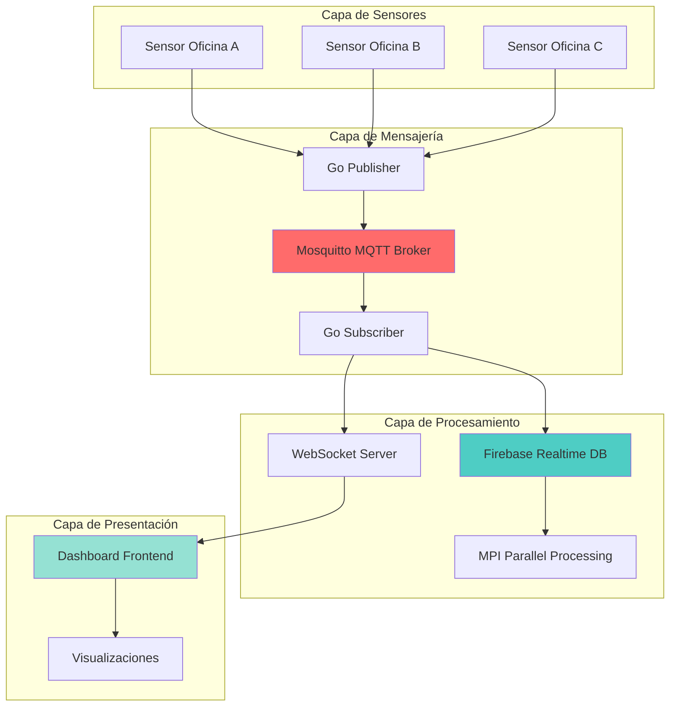

## Arquitectura del Sistema



## Características Principales

### <i class="fas fa-plug"></i> Comunicación en Tiempo Real

El sistema utiliza **WebSockets** para transmitir datos en tiempo real desde el backend hacia el dashboard:

- `/ws/resumenes` - Resúmenes de consumo por oficina
- `/ws/avisos` - Alertas y notificaciones del sistema
- `/ws/dispositivos` - Estado de dispositivos (luces, aire acondicionado)
- `/ws/params` - Parámetros de configuración
- `/ws/oficinas` - Gestión de oficinas

### <i class="fas fa-broadcast-tower"></i> Arquitectura MQTT

Utiliza el patrón **Publisher/Subscriber** con Mosquitto:

```
oficinas/{id}/sensores
```

Cada mensaje contiene:
- Timestamp
- Presencia (boolean)
- Corriente (Amperes)
- Temperatura (°C)

### <i class="fas fa-rocket"></i> Inicio Rápido

```bash
# 1. Instalar dependencias
./monitoreo.sh instalar

# 2. Iniciar el sistema completo
./monitoreo.sh comenzar

# 3. Acceder al dashboard
# `http://localhost:8080`
```

## Componentes del Sistema

| Componente | Tecnología | Puerto | Descripción |
|------------|-----------|--------|-------------|
| MQTT Broker | Mosquitto | 1883 | Broker de mensajes |
| Publisher | Go | - | Simulación de sensores |
| Subscriber | Go | - | Procesamiento de datos |
| WebSocket Server | Node.js | 8081 | Distribución en tiempo real |
| Dashboard | Node.js | 8080 | Interfaz web |
| Firebase | Cloud | - | Base de datos |

## Flujo de Datos

1. **Generación**: El Publisher simula datos de sensores cada 10 segundos
2. **Publicación**: Los datos se publican en tópicos MQTT
3. **Suscripción**: El Subscriber recibe y procesa los mensajes
4. **Análisis**: Se detectan alertas y se generan resúmenes cada 60 segundos
5. **Persistencia**: Los datos se guardan en Firebase
6. **Distribución**: WebSocket transmite datos al dashboard
7. **Visualización**: El frontend muestra gráficos en tiempo real

## Próximos Pasos

<div class="tip custom-block">
  <p class="custom-block-title"><i class="fas fa-lightbulb"></i> Recomendación</p>
  <p>Comienza con la <a href="/guide/introduction">Guía de Introducción</a> para entender la arquitectura completa del sistema.</p>
</div>

---

<div style="text-align: center; margin-top: 3rem; padding: 2rem; background: linear-gradient(135deg, #667eea 0%, #764ba2 100%); border-radius: 12px; color: white;">
  <h3>¿Listo para comenzar?</h3>
  <p>Explora la documentación completa y aprende a utilizar todas las características del sistema.</p>
  <a href="/guide/introduction" style="display: inline-block; margin-top: 1rem; padding: 0.75rem 2rem; background: white; color: #667eea; border-radius: 8px; text-decoration: none; font-weight: bold;">Ir a la Guía →</a>
</div>
